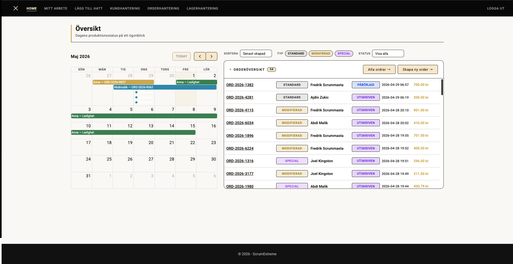
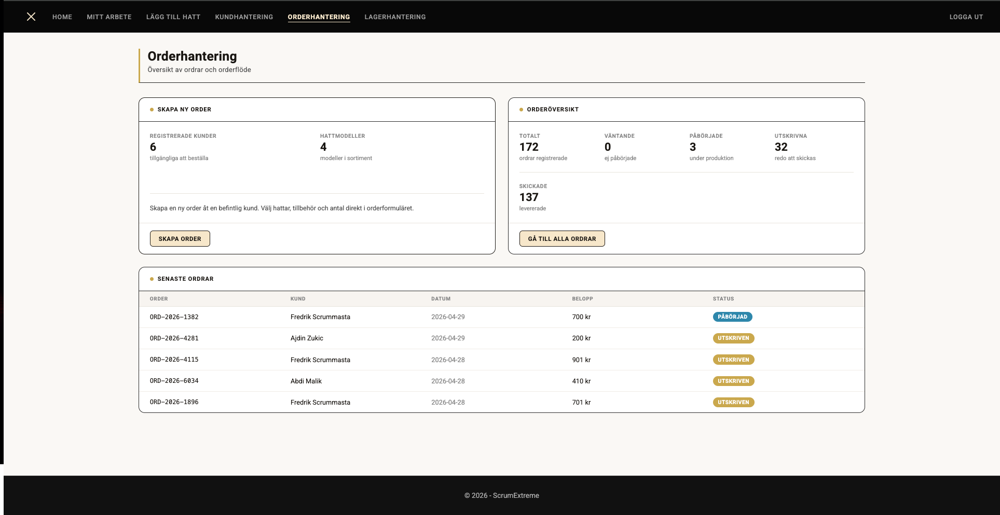
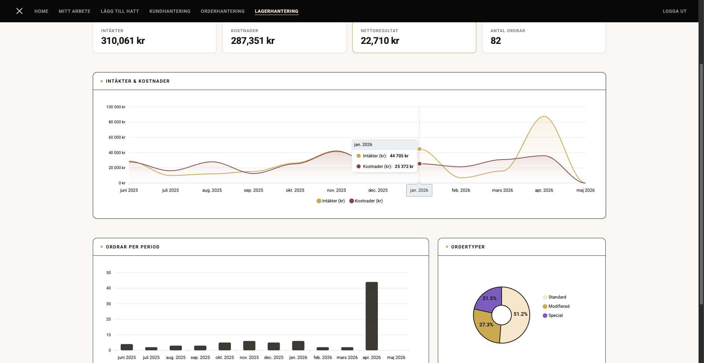
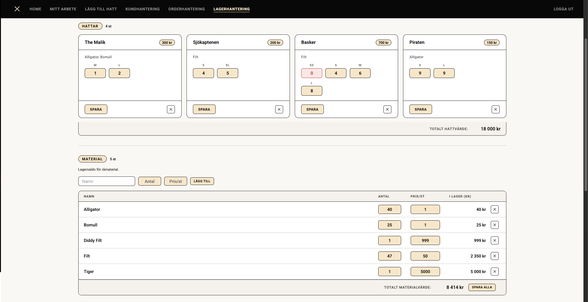

<div align="center">

# 🎩 Otto's Hat Shop: Business Management System

**A full-stack ASP.NET Core MVC platform for managing orders, inventory, customers, and statistics—built with Clean Architecture and MongoDB under the hood.**

</div>

## 💡 Description

Otto's Hat Shop is a school project developed at Örebro University (VT26) using Scrum and Extreme Programming methodologies. It's a complete business management system for a hat manufacturing company—covering everything from raw material tracking and warehouse management to order processing and sales statistics.

The goal was to build a real-world, production-ready web application while practicing agile development workflows. The end result is a multi-layered system that handles the full business lifecycle of a product from materials to delivered orders.

### Key Architectural Highlights:

- **Clean Architecture Layers:** The project is split into four distinct layers—**Domain** (entities & business rules), **Application** (interfaces & services), **Infrastructure** (database & repository), and **Web** (controllers & views). Dependencies flow inward, keeping core logic decoupled from frameworks.
- **MongoDB + Generic Repository:** All data persistence is handled through a generic `IRepository<T>` pattern backed by MongoDB, making it easy to swap implementations without touching business logic.
- **Session-Based Authentication:** Custom `AuthFilter` handles route protection and session management using BCrypt-hashed passwords—no heavy Identity framework needed.
- **Dependency Injection Throughout:** Every service and repository is wired up via .NET's built-in DI container, keeping the codebase testable and modular.
- **Docker-Ready:** Docker Compose setup included for spinning up the database with a single command.

---

## 🧰 Tech Stack

<p align="center">
  &nbsp;&nbsp;&nbsp;&nbsp;&nbsp;&nbsp;&nbsp;&nbsp;
</p>

---

## 🎯 Features

### 📦 Order Management

- **Full Order Lifecycle:** Create, view, and manage customer orders with line items and quantities
- **Order Items:** Each order tracks individual products with amounts and pricing
- **Shipping Labels:** Generate shipping label views directly from an order

### 🏭 Warehouse & Inventory

- **Stock Tracking:** Real-time inventory levels for products and materials
- **Material Management:** Add and monitor raw materials used in production
- **Warehouse Overview:** Aggregated view of all available stock

### 👤 Customer & Employee Management

- **Customer Registry:** Add and manage customers with contact information
- **Employee Accounts:** User management with role-based access (owner, employee)
- **Secure Login:** BCrypt-hashed passwords with session-based authentication

### 📊 Statistics & Reporting

- **Sales Statistics:** Track revenue and order volume over time
- **Purchase Records:** Log and review procurement history
- **Material Summary:** Overview of material consumption and costs

### 🗓️ Calendar

- **Event Scheduling:** Create and manage calendar events for the business
- **Company-Wide View:** Shared calendar accessible across the team

---

## 🖼️ Screenshots

<p align="center">
  
</p>
<p align="center">
  <strong>Screenshot 1:</strong> The main dashboard — the central hub after login showing navigation to all business modules.
</p>

<p align="center">
  
</p>
<p align="center">
  <strong>Screenshot 2:</strong> Order management view showing the full list of customer orders with status and details.
</p>

<p align="center">
  
</p>
<p align="center">
  <strong>Screenshot 3:</strong> Sales statistics page displaying revenue trends and order volume over time.
</p>

<p align="center">
  
</p>
<p align="center">
  <strong>Screenshot 4:</strong> Warehouse and inventory management showing current stock levels across all products and materials.
</p>

---

## ⚙️ How to Run

### Prerequisites

- **.NET 10 SDK**
- **MongoDB** (local instance or Atlas)
- **Docker Desktop** (optional, for the database)

### Option 1: Docker + Local Run

```bash
# 1. Clone the repository
git clone https://github.com/Nordtess/OttosHatShop
cd OttosHatShop

# 2. Start the database
docker-compose up -d

# 3. Configure MongoDB connection in appsettings.json
# Set MongoDB:ConnectionString and MongoDB:DatabaseName

# 4. Run the app
cd src/ScrumExtreme.Web
dotnet run
```

### Option 2: Fully Local

```bash
# 1. Clone the repository
git clone https://github.com/Nordtess/OttosHatShop
cd OttosHatShop

# 2. Make sure MongoDB is running locally

# 3. Restore dependencies
dotnet restore

# 4. Run the web project
cd src/ScrumExtreme.Web
dotnet run
```

### Project Structure

```
ScrumExtreme/
├── src/
│   ├── ScrumExtreme.Domain/        # Core business entities
│   │   ├── Entities/               # Order, Product, User, Material, etc.
│   │   ├── Interfaces/             # IRepository<T>
│   │   └── Attributes/             # CollectionName (MongoDB mapping)
│   ├── ScrumExtreme.Application/   # Business logic layer
│   │   ├── Interfaces/             # Service contracts
│   │   └── Services/               # OrderService, UserService, etc.
│   ├── ScrumExtreme.Infrastructure/ # Data access
│   │   └── Repositories/           # Generic MongoDB repository
│   └── ScrumExtreme.Web/           # Presentation layer
│       ├── Controllers/            # 20 MVC controllers
│       ├── Views/                  # Razor views
│       ├── Models/                 # View models
│       ├── Filters/                # AuthFilter (session auth)
│       └── wwwroot/                # Static files
├── tests/
│   └── ScrumExtreme.Tests/
├── docker-compose.yml
└── ScrumExtreme.slnx
```

---

## 🔐 Security

- **BCrypt Password Hashing:** Passwords are never stored in plaintext—BCrypt.Net handles secure hashing
- **Session-Based Auth:** `HttpOnly`, `SameSite=Strict` cookies protect against XSS and CSRF
- **Route Protection:** Global `AuthFilter` enforces authentication on all protected routes
- **MongoDB Driver:** Parameterized queries via the official driver prevent injection attacks

---

## 🛠️ Technologies & Patterns

**Backend:**

- ASP.NET Core 10.0 MVC
- MongoDB + MongoDB.Driver 3.4
- BCrypt.Net-Next (password hashing)
- Clean Architecture (Domain / Application / Infrastructure / Web)
- Generic Repository Pattern (`IRepository<T>`)
- Dependency Injection (built-in .NET DI)
- Session-based authentication with custom `AuthFilter`

**Frontend:**

- Razor Views (server-side rendering)
- Bootstrap (responsive UI)

**DevOps:**

- Docker & Docker Compose
- Environment-based configuration via `appsettings.json`

---

## 📝 Roadmap

- [ ] Role-based access control (owner vs. employee views)
- [ ] PDF export for orders and shipping labels
- [ ] REST API layer for potential mobile clients
- [ ] Real-time notifications with SignalR
- [ ] Unit & integration test coverage

---

## 👨‍💻 Author

**Nordtess**  
_Full-Stack Developer & Clean Architecture Enthusiast_

---

## 📜 License

This project is licensed under the MIT License—feel free to use it, learn from it, or build upon it!

---

<div align="center">

**Built with ❤️ and way too much coffee in Sweden 🇸🇪**

</div>
